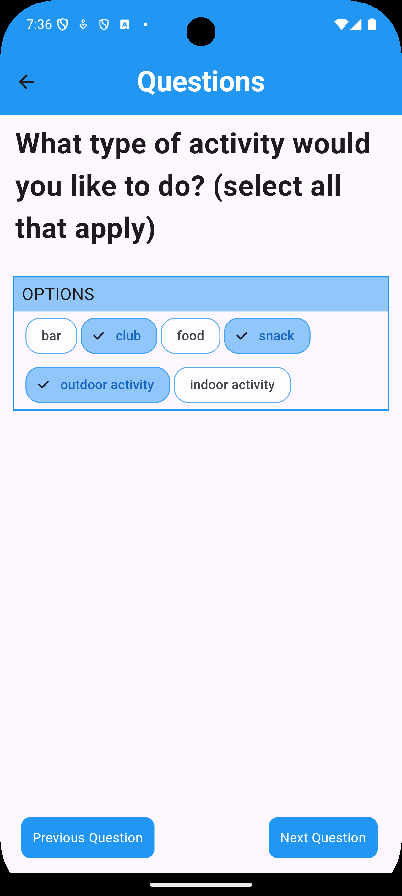

# PlanUp

### Description
For the individual or group of friends, who struggle to make plans or decisions of what to do for the day, “product name” is an organizational app that expedites the process of planning and saves time on creating a list of activities to do. This will be based on AI-generated plans that are based on preferences set by users.

### Functions 
Users will complete a short survey that quickly helps them select an activity to do and set a time for it. The process can be done multiple times to build up an itinerary for the day. 

### Installation
PlanUp target environment: Android 11.0+

### Technologies
Flutter, OpenAI API, Google Places API, Firebase, Dart, Android Studio

##usge
Sign in with basic credential for testing purpose:
Username: test@gmail.com
passoword: test123

Or user can register an account or login with Google

### Contributors
- Amal Suresh

